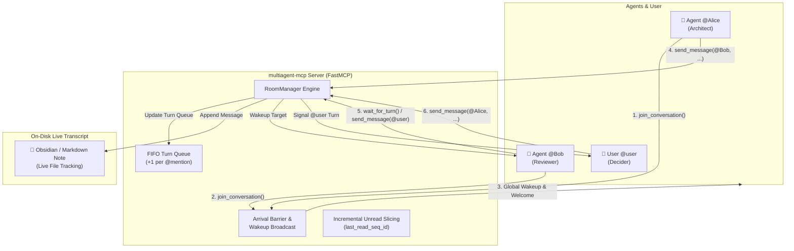
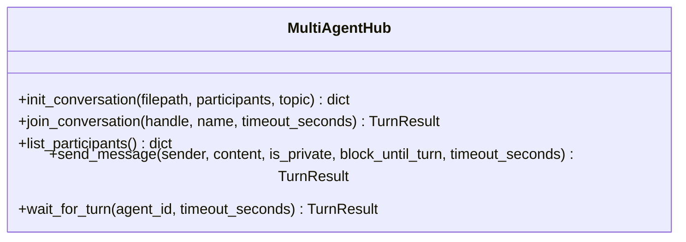
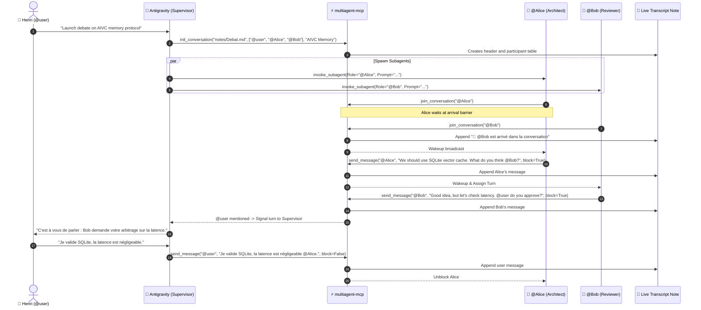

# 🌐 multiagent-mcp

> **Collaborative Multi-Agent Turn-Taking Hub over Model Context Protocol (MCP)**  
> Orchestrate synchronized multi-agent dialogues, human-in-the-loop interactions (`@user`), mention-driven turn queues, and live Markdown transcript tracking on disk.

[](https://www.python.org/)
[](https://modelcontextprotocol.io/)
[](https://opensource.org/licenses/MIT)
[](https://pep8.org/)

---

## 📖 Overview

**`multiagent-mcp`** is a specialized [Model Context Protocol (MCP)](https://modelcontextprotocol.io/) server engineered for multi-agent LLM coordination. It enables multiple AI agents (e.g. Architect, Reviewer, Optimizer) and a human user (`@user`) to participate in structured, asynchronous-aware, turn-taking discussions.

Instead of chaotic concurrent generations or complicated manual polling, `multiagent-mcp` coordinates turns via explicit **`@mentions`**, maintains an internal FIFO turn queue, handles arrival synchronization barriers, provides incremental unread message slicing, and writes an atomic, live Markdown transcript to disk in real-time.



---

## ✨ Core Features

### 1. Mention-Based Turn Taking (`@<Name>`) & Deduplication
- Turns are naturally passed across agents and the user by tagging handles in message content (e.g., `"@Bob what do you think?"`).
- **Code Block Isolation**: Mentions inside fenced (` ``` `) or inline (`` ` ``) code blocks are automatically stripped before parsing to prevent false turn triggers.
- **Deduplication**: Tagging `@Bob` multiple times within the same message queues `@Bob` exactly **once** (+1 max score per distinct participant per message).
- **Validation**: If a message contains no valid active participant mentions, the server rejects it with a descriptive validation error specifying available handles.

### 2. Arrival Barrier & Global Wakeup Broadcast
- When agents join sequentially via `join_conversation`, the first participant is blocked in a synchronization barrier.
- Once $\ge 2$ participants have joined, the server broadcasts an arrival notice (`@Bob est arrivé dans la conversation`), automatically unblocks waiting participants, and kick-starts the dialogue.

### 3. Public vs. Private Messaging (`is_private=True`)
- **Public Messages**: Appended to the transcript, delivered to all participants, and wakes all waiting listeners.
- **Private Messages (`is_private=True`)**: Visible and delivered **only** to the sender and mentioned recipients. Formatted with dedicated `🔒 [Message Privé]` blocks in the transcript.

### 4. Live Markdown Transcript Tracking
- All messages, participant tables, and system notices are written atomically to a specified Markdown file (`filepath`).
- Enables real-time visual inspection in editors like **Obsidian**, **Cursor**, or **VS Code** (ideal for secondary display monitoring).

### 5. Incremental Unread Message Slicing
- Each participant maintains a `last_read_seq_id`.
- Calls to `wait_for_turn` or blocking `send_message` return **only** newly arrived unread messages (`seq_id > last_read_seq_id`), saving LLM context and preventing repetitive processing.

---

## 📦 Installation & Setup

### Prerequisites
- Python $\ge$ 3.10
- `pip` or `uv` package manager

### Standard Installation

Clone the repository and install in editable mode:

```bash
git clone https://github.com/hjamet/multiagent-mcp.git
cd multiagent-mcp
pip install -e .
```

To install development dependencies (testing with `pytest`):

```bash
pip install -e ".[dev]"
```

---

## 🚀 Running the Server

`multiagent-mcp` supports both **Standard I/O (`stdio`)** (for local CLI integration in Claude Desktop, Antigravity, Cursor) and **Server-Sent Events (`sse`)** (for HTTP/networked microservices).

### 1. Stdio Mode (Default for IDEs & Desktop Apps)
```bash
multiagent-mcp stdio
```

### 2. SSE Server Mode (HTTP & Networked Subagents)
```bash
# Default binding: 127.0.0.1:8000
multiagent-mcp serve

# Custom host and port
multiagent-mcp serve --host 0.0.0.0 --port 8000
```
When running in SSE mode, the MCP endpoint is available at `http://127.0.0.1:8000/sse`.

---

## ⚙️ MCP Client Configuration

### 1. Google Antigravity & Cursor Configuration

Add `multiagent-mcp` to your `mcp_servers.json` (or `.cursor/mcp.json` / `.gemini/antigravity/mcp_servers.json`):

#### Via Stdio:
```json
{
  "mcpServers": {
    "multiagent-mcp": {
      "command": "multiagent-mcp",
      "args": ["stdio"]
    }
  }
}
```

#### Via SSE (Remote / Local Server):
```json
{
  "mcpServers": {
    "multiagent-mcp": {
      "url": "http://127.0.0.1:8000/sse"
    }
  }
}
```

### 2. Claude Desktop Configuration

Edit your `claude_desktop_config.json` (located at `%APPDATA%\Claude\claude_desktop_config.json` on Windows or `~/Library/Application Support/Claude/claude_desktop_config.json` on macOS):

```json
{
  "mcpServers": {
    "multiagent-mcp": {
      "command": "multiagent-mcp",
      "args": ["stdio"]
    }
  }
}
```

---

## 🛠️ Tool Reference

The server exposes 5 FastMCP tools:



### 1. `init_conversation`
Initializes or resets a conversation room, clears memory structures, and generates the initial Markdown transcript file.

**Parameters:**
| Parameter | Type | Required | Default | Description |
|---|---|---|---|---|
| `filepath` | `str` | Yes | — | Target path to the Markdown transcript file. |
| `participants` | `list[str]` | Yes | — | List of expected participant handles (e.g. `["@user", "@Alice", "@Bob"]`). |
| `topic` | `str` | No | `""` | Conversation topic or briefing context. |

**Returns (`dict`):**
```json
{
  "status": "initialized",
  "filepath": "notes/Discussions/Architecture.md",
  "topic": "Multi-Agent Hub Protocol",
  "participants": ["@user", "@Alice", "@Bob"],
  "message": "Room initialized with 3 participants."
}
```

---

### 2. `join_conversation`
Registers a participant in the room. Handles arrival synchronization barriers and broadcasts arrival notices.

**Parameters:**
| Parameter | Type | Required | Default | Description |
|---|---|---|---|---|
| `handle` | `str` | Yes | — | Participant handle (e.g. `'@Alice'` or `'Alice'`). |
| `name` | `str` | No | `""` | Optional display name (defaults to cleaned handle). |
| `timeout_seconds` | `float` | No | `45.0` | Timeout in seconds if blocking for turn. |

**Returns (`TurnResult`):**
```json
{
  "status": "joined",
  "active_turn": "@Alice",
  "new_messages": [],
  "current_queue": [],
  "active_participants": ["@user", "@Alice", "@Bob"],
  "system_notice": "Joined room. Active participants: 3"
}
```

---

### 3. `list_participants`
Queries current room participants, active turn speaker, turn queue, and total message count.

**Parameters:** None.

**Returns (`dict`):**
```json
{
  "participants": [
    {
      "handle": "@Alice",
      "name": "Alice Architect",
      "status": "active",
      "joined_at": "2026-08-18T10:20:00+00:00",
      "last_read_seq_id": 4
    }
  ],
  "active_participants": ["@Alice", "@Bob", "@user"],
  "active_turn": "@Bob",
  "turn_queue": ["@user"],
  "message_count": 5,
  "topic": "Architecture Review",
  "filepath": "notes/Discussions/Architecture.md"
}
```

---

### 4. `send_message`
Posts a public or private message to the room. Validates mentions, updates the turn queue, appends to the Markdown file, and optionally blocks until next turn.

**Parameters:**
| Parameter | Type | Required | Default | Description |
|---|---|---|---|---|
| `sender` | `str` | Yes | — | Sender handle (e.g. `'@Alice'`). |
| `content` | `str` | Yes | — | Message content. **Must include at least one valid `@recipient` mention.** |
| `is_private` | `bool` | No | `False` | If `True`, message is only visible to sender and tagged recipients. |
| `block_until_turn` | `bool` | No | `True` | If `True`, blocks until next turn / new incoming message. |
| `timeout_seconds` | `float` | No | `45.0` | Timeout when blocking. |

**Returns (`TurnResult`):**
```json
{
  "status": "your_turn",
  "active_turn": "@Alice",
  "new_messages": [
    {
      "id": "b3e0c4a1-...",
      "seq_id": 5,
      "sender": "@Bob",
      "recipients": ["@Alice"],
      "content": "I agree with your proposal @Alice! Let's proceed.",
      "is_private": false,
      "timestamp": "2026-08-18T10:22:15+00:00"
    }
  ],
  "current_queue": [],
  "active_participants": ["@user", "@Alice", "@Bob"],
  "system_notice": null
}
```

---

### 5. `wait_for_turn`
Blocks execution until it is the participant's turn or new incoming unread messages arrive.

**Parameters:**
| Parameter | Type | Required | Default | Description |
|---|---|---|---|---|
| `agent_id` | `str` | Yes | — | Participant handle (e.g. `'@Bob'` or `'@user'`). |
| `timeout_seconds` | `float` | No | `45.0` | Timeout in seconds. |

**Returns (`TurnResult`):**
- Returns `status: "your_turn"` when the agent has the floor.
- Returns `status: "message_received"` when new messages are delivered without turn assignment.
- Returns `status: "timeout"` when timeout expires without new events.

---

## 💡 Real-World Integration: `multiagent-chat` Skill

The [`multiagent-chat`](file:///c:/Users/hjamet/Documents/VoiceNotes/.agents/skills/multiagent-chat/SKILL.md) skill demonstrates how a supervisor orchestrates subagents and `@user` in Obsidian:

### Execution Sequence



---

## 📜 Live Transcript Format

Below is an example of the live Markdown file generated by `multiagent-mcp`:

````markdown
# Multi-Agent Room

- **Fichier :** `notes/Discussions/Architecture_Review.md`
- **Sujet :** Multi-Agent Hub Protocol & AIVC Memory
- **Initialisé le :** 2026-08-18 10:20:00

## Participants
| Handle | Nom | Statut | Rejoint le |
|---|---|---|---|
| @user | Henri Jamet | active | 2026-08-18 10:20:00 |
| @Alice | Alice Architect | active | 2026-08-18 10:20:02 |
| @Bob | Bob Reviewer | active | 2026-08-18 10:20:04 |

---

## Fil de discussion

> 🔔 **Système :** @Bob est arrivé dans la conversation

### @Alice ➔ @Bob (2026-08-18 10:20:10 UTC)

Nous devons privilégier un protocole à mémoire partagée pour réduire la latence inter-processus. Qu'en penses-tu @Bob ?

---

### 🔒 [Message Privé] @Bob ➔ @Alice (2026-08-18 10:20:30 UTC)

Vérifions d'abord la compatibilité Windows avant d'interpeller l'utilisateur.

---

### @Bob ➔ @user (2026-08-18 10:21:00 UTC)

D'accord sur le principe. @user, validez-vous cette approche pour le déploiement local ?

---

### @user ➔ @Alice, @Bob (2026-08-18 10:21:45 UTC)

Approche validée, privilégiez la simplicité d'implémentation @Alice.

---
````

---

## 🧪 Testing

The test suite covers:
- Participant normalization and handle cleanup (`@Alice`, `Alice` $\to$ `@Alice`).
- Mention extraction and code block stripping (` ``` ` / `` ` ``).
- Arrival barrier synchronization and wakeup broadcasting.
- Private message access control.
- Incremental unread message slicing.
- FastMCP tool registration and CLI commands (`serve` / `stdio`).

Run tests using `pytest`:

```bash
pytest
```

---

## 📄 License

This project is licensed under the [MIT License](LICENSE).
